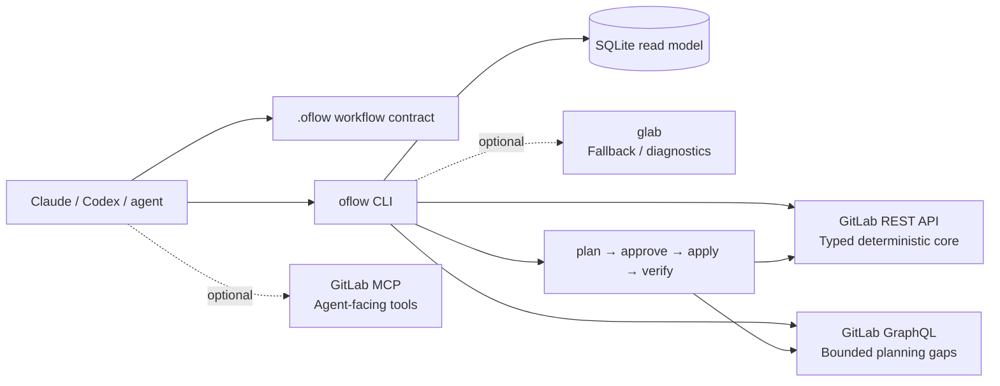

<p align="center">
  
</p>

<h1 align="center">oflow</h1>

<p align="center">
  <strong>A GitLab-first operating layer for Claude, Codex, and other coding agents.</strong><br />
  Turn GitLab planning data into focused agent context — then make remote changes through explicit, auditable gates.
</p>

<p align="center">
  <a href="https://github.com/PolderLabsVOF/agent-workflow"></a>
  
  
  
</p>

<p align="center">
  <em>Small CLI. Compact context. Strong safety boundaries.</em>
</p>

---

## Why oflow?

Coding agents are good at reasoning, but they need a reliable project surface:

- What is assigned to me right now?
- Which story is active, and what are its acceptance criteria?
- What is the current sprint, board, milestone, MR, and pipeline state?
- What can be changed safely, and what still needs approval?
- How do we avoid spending tokens re-downloading the same planning data?

`oflow` answers those questions with a checked-in workflow contract, a typed
GitLab adapter, compact machine-readable reports, a local SQLite read model,
and a guarded mutation lifecycle.

```text
GitLab is the source of truth
        ↓
oflow collects compact evidence
        ↓
SQLite makes repeated agent reads fast
        ↓
the agent reasons over focused context
        ↓
remote changes follow plan → approve → apply → verify
```

## What is working today

| Area | What oflow provides |
| --- | --- |
| **Agent contract** | Generates `.oflow/WORKFLOW.md`, `AGENTS.md`, and `CLAUDE.md` instructions that teach agents the project flow. |
| **Scrum planning** | Work items, labels, boards, milestones, iterations, group epics, filters, ownership, and timeboxes. |
| **Story context** | Acceptance criteria, local evidence pointers, linked merge requests, notes, pipelines, and progress assessment. |
| **Fast reads** | Compact `sync --summary`, exact cached snapshots, and SQLite-backed assigned-work reads. |
| **Current-user work** | `work --mine --refresh` resolves the authenticated GitLab user and caches assigned work. |
| **Safe writes** | Issues, notes, labels, milestones, boards, board lists, and bounded owner/timebox/iteration changes. |
| **Evidence verification** | MR acceptance evidence and matching successful pipeline checks, including head-SHA validation when available. |
| **Auditability** | Local plan artifacts and lifecycle audit records without storing tokens or full sensitive payloads. |

## Quick start

### 1. Install and scaffold a GitLab repository

Requires Node.js **22.5 or newer**. SQLite uses Node's built-in `node:sqlite`
module, so oflow does not add a native database dependency.

```bash
npm install -g oflow

cd /path/to/your-gitlab-repository
oflow install
```

`oflow install` detects the available agent runtimes, derives the GitLab
project from `origin`, and creates or updates only the project-local contract:

```text
.oflow/
  config.json
  WORKFLOW.md                 # shared agent contract
  README.md                   # local operating notes
  templates/merge-request.md  # acceptance-aware MR template
AGENTS.md                     # managed Codex instructions
CLAUDE.md                     # managed Claude instructions
```

The installer is idempotent. It preserves user-authored instruction content
and refreshes only the managed oflow blocks. This includes the mandatory cache
policy, even when `.oflow/WORKFLOW.md` already existed before oflow was updated.

### 2. Connect GitLab securely

```bash
oflow auth login
oflow doctor --check-api
```

The token is entered without echoing and stored outside the repository in the
user's oflow configuration directory with owner-only permissions. Credentials
are stored per GitLab host and never written to `.oflow/config.json`, agent
instruction files, SQLite, or Git.

For automation, use an environment variable or stdin rather than a command-line
argument:

```bash
export GITLAB_TOKEN=glpat-...
# or: printf '%s' "$GITLAB_TOKEN" | oflow auth set --token-stdin
```

`GITLAB_TOKEN`, `GITLAB_ACCESS_TOKEN`, and `GITLAB_PRIVATE_TOKEN` are supported;
environment variables take precedence over stored credentials.

### 3. Give agents the low-token daily flow

The generated workflow contract hands agents this policy automatically:

```bash
# Start of a work session: establish current truth.
oflow work --mine --refresh --json
oflow sync --summary --refresh --json

# During exploration: use the local read model.
oflow work --mine --cached --json
oflow sync --summary --cached --json

# Select a story and load detailed evidence only when needed.
oflow context --story 42 --json
oflow assess --story 42 --json

# Before remote changes: refresh, then use the guarded lifecycle.
oflow work --mine --refresh --json
oflow plan issue update --story 42 --add-labels "In Progress"
oflow approve .oflow/state/plans/<plan-id>.json
oflow apply .oflow/state/plans/<plan-id>.json
oflow verify --plan .oflow/state/plans/<plan-id>.json

# After applying: converge the local read model again.
oflow work --mine --refresh --json
oflow sync --summary --refresh --json
```

If refresh fails, agents may continue local analysis but must not apply a
remote mutation. Cached data is for orientation, never proof of current remote
state.

## GitLab integration architecture



The ownership model is deliberate:

1. **GitLab REST is the core backend.** It provides predictable, typed,
   compact Scrum and delivery reads and the current guarded write paths.
2. **GraphQL is used narrowly.** Iteration assignment and selected group-epic
   reads use bounded queries or mutations where the REST API is insufficient.
3. **`glab` is optional.** It is useful for detection, diagnostics, and an
   explicit GET-only fallback for endpoints oflow has not wrapped yet. It is
   not an npm dependency and cannot bypass write gates.
4. **MCP is optional.** A GitLab MCP server can give an agent conversational
   access to GitLab, but oflow does not assume an MCP server exists or silently
   configure one. The workflow contract and safety gates remain authoritative.

See [`docs/GITLAB-INTEGRATION.md`](docs/GITLAB-INTEGRATION.md) for the full
backend, authentication, security, and MCP decision record.

### Optional GitLab MCP for NestPod

MCP configuration belongs in the agent's user-level settings, not in the
repository. For the NestPod self-managed GitLab instance, the endpoint is:

```json
{
  "mcpServers": {
    "GitLab": {
      "type": "http",
      "url": "https://gitlab.fdmci.hva.nl/api/v4/mcp"
    }
  }
}
```

The MCP client handles its own authorization. Do not copy the oflow token into
MCP configuration. The instance administrator must allow MCP access, and MCP
availability does not replace oflow's local contract or write safeguards.

## The local read model

oflow treats SQLite as a fast local **read model**, not as a second source of
truth:

- `.oflow/cache/oflow.db` is ignored by Git and contains no credentials.
- Work items are stored compactly with indexed state, update time, labels, and
  assignees.
- `--cached` never contacts GitLab and reports the snapshot source and age.
- Cache keys include the host, project, state, limit, filters, and query mode.
- A different query produces a cache miss instead of returning an unrelated
  snapshot.
- Live reads refresh the local model; remote writes never rely on cache
  freshness as a safety precondition.

This gives agents a useful split: refresh deliberately at session boundaries
and mutation boundaries, then use cheap local reads while exploring and coding.

## Command map

### Read and understand

```bash
oflow work [filters]                 # compact GitLab work items
oflow work --mine --refresh          # refresh authenticated user's work
oflow work --mine --cached           # local assigned-work read
oflow sync --summary --json          # smallest project handoff
oflow sync --json                    # bounded Scrum + MR + pipeline snapshot
oflow sync --cached --json           # no-network matching snapshot
oflow epic --limit 20                # parent-group epics
oflow epic --iid 12                  # epic hierarchy
oflow iteration --state current      # current project-visible sprint
oflow iteration --group --state current
oflow cadence --json                 # parent-group cadence schedule
oflow context --story 42             # full story context
oflow assess --story 42 --json       # deterministic progress evidence
oflow mr --iid 8 --json              # compact MR status
oflow mr --iid 8 --full              # include MR description
oflow verify --story 42              # acceptance + pipeline verification
oflow capabilities --json            # implemented/planned/optional paths
oflow audit --json                   # local plan lifecycle history
```

Use server-side filters to keep responses small:
`--label`, `--milestone`, `--iteration`, `--epic`, `--assignee`, `--author`,
`--search`, `--updated-after`, `--updated-before`, and `--limit`.

### Plan and change safely

Every supported remote write is explicit:

```bash
oflow plan issue update --story 42 --labels "Ready,backend"
oflow plan issue update --story 42 --iteration "Sprint 2"
oflow plan issue note --story 42 --body "Progress: API contract confirmed."
oflow plan issues labels --stories 17,18,23 --add-labels "Ready"
oflow plan issues update --stories 17,18,23 --milestone "Sprint 1"
oflow plan label update --label "Ready" --color "#36A269"
oflow plan milestone update --milestone 1 --state closed
oflow plan board create --name "Product Backlog"
oflow plan board-list create --board 1 --label "Ready"

oflow approve .oflow/state/plans/<plan-id>.json
oflow apply .oflow/state/plans/<plan-id>.json
oflow verify --plan .oflow/state/plans/<plan-id>.json
```

Plans capture target state and `updated_at` preconditions. Apply re-reads the
target immediately before writing and refuses to overwrite a newer change.
Bulk operations are bounded, persist partial progress, and can be reviewed and
resumed safely.

## Capability status

| Capability | Status | Notes |
| --- | :---: | --- |
| Project install and agent detection | ✅ | Claude/Codex project contract, idempotent scaffolding |
| GitLab auth and API doctor | ✅ | Host-aware credentials, safe status, read-only API check |
| Work-item reads and filters | ✅ | Compact REST reads with pagination metadata |
| Assigned-work cache | ✅ | SQLite, WAL, exact query keys, offline reads |
| Summary/project sync | ✅ | Low-token planning and delivery snapshot |
| Story context and assessment | ✅ | Acceptance criteria, local evidence, MR/pipeline context |
| Labels, milestones, boards, board lists | ✅ | Guarded plan/apply/verify operations |
| Iteration reads and assignment | ✅ | Project/group reads plus guarded GraphQL assignment |
| Group epics | ✅ | Explicit opt-in bounded GraphQL reads |
| Merge-request and pipeline reads | ✅ | Compact status and verification evidence |
| `glab` fallback | ◐ Optional | Explicit GET-only diagnostics and unwrapped reads |
| GitLab MCP | ◐ Optional | Agent-facing companion; not required by oflow |
| Merge-request writes | ◌ Planned | Deliberately later in the roadmap |
| Local planning dashboard | ◌ Next | Loopback-only UI over the SQLite read model |

## Roadmap

### Delivered — workflow and Scrum foundation

- Checked-in agent contract and safe project installation.
- Host-aware token storage outside repositories.
- Compact project sync for stories, labels, boards, milestones, iterations,
  merge requests, pipelines, and optional epics.
- SQLite read model for assigned work and future local dashboard queries.
- Acceptance-aware story context, assessment, and verification.
- Guarded issue, planning, label, milestone, board, and bounded bulk writes.

### Next — local planning dashboard

- Extend the SQLite model with merge-request, pipeline, iteration, and
  sync-history snapshots.
- Add cache status, age, invalidation, and migration diagnostics.
- Build a loopback-only read-only dashboard for local project visibility.
- Add explicit refresh controls without exposing GitLab credentials to the
  dashboard or browser.

### Later — delivery integration

- Merge-request lifecycle reads and writes with the same safety gates.
- Richer pipeline and deployment evidence.
- More GitLab Work Item hierarchy operations.
- Additional provider capabilities only when they preserve the local contract.

The detailed staged plan lives in [`docs/ROADMAP.md`](docs/ROADMAP.md), and the
Scrum/planning contract lives in [`docs/SCRUM-PLANNING.md`](docs/SCRUM-PLANNING.md).

## Workflow contract

Stories are GitLab Issues in v0.1. Their description should contain an
`Acceptance criteria` heading with checkbox items. oflow preserves explicit
criterion IDs such as `AC-1` and assigns stable IDs when they are omitted.

An MR generated from a story should include one checked item and one concrete,
non-placeholder `Evidence:` line for every criterion. Verification also
requires the latest relevant pipeline to have status `success` and match the
MR head SHA when GitLab exposes one.

## Development

```bash
npm install
npm test
npm run typecheck
npm pack --dry-run
```

The package is intentionally dependency-light. Provider-specific API behavior
belongs in adapters, while the local workflow contract remains stable.

## Learn more

- [`docs/GITLAB-INTEGRATION.md`](docs/GITLAB-INTEGRATION.md) — REST, GraphQL,
  `glab`, MCP, auth, and security boundaries.
- [`docs/SCRUM-PLANNING.md`](docs/SCRUM-PLANNING.md) — agent planning contract,
  cache policy, Scrum reads, and guarded writes.
- [`docs/ROADMAP.md`](docs/ROADMAP.md) — staged product direction.

## License

MIT
