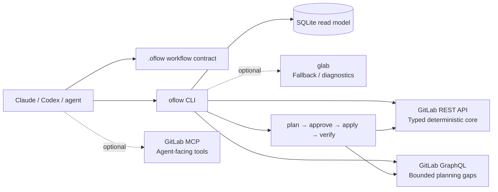

<h1 align="center">oflow</h1>

<p align="center">
  <strong>A GitLab-first operating layer for Claude, Codex, and other coding agents.</strong><br />
  Turn GitLab planning data into focused agent context — then make remote changes through explicit, auditable gates.
</p>

<p align="center">
  <a href="https://github.com/PolderLabs/oflow"></a>
  <a href="https://www.npmjs.com/package/oflow-workflow"></a>
  <a href="https://github.com/PolderLabs/oflow/releases"></a>
  
  
  
</p>

<p align="center">
  <em>Small CLI. Compact context. Strong safety boundaries.</em>
</p>

---

## Why oflow?

Coding agents are good at reasoning, but they need a reliable project surface:

- What is assigned to me right now?
- Which story is active, and what are its acceptance criteria?
- What is the current sprint, board, milestone, MR, and pipeline state?
- What can be changed safely, and what still needs approval?
- How do we avoid spending tokens re-downloading the same planning data?

`oflow` answers those questions with a checked-in workflow contract, a typed
GitLab adapter, compact machine-readable reports, a local SQLite read model,
and a guarded mutation lifecycle.

```text
GitLab is the source of truth
        ↓
oflow collects compact evidence
        ↓
SQLite makes repeated agent reads fast
        ↓
the agent reasons over focused context
        ↓
remote changes follow plan → approve → apply → verify
```

## What is working today

| Area | What oflow provides |
| --- | --- |
| **Agent contract** | Generates `.oflow/WORKFLOW.md`, `AGENTS.md`, and `CLAUDE.md` instructions that teach agents the project flow. |
| **Scrum planning** | Work items, labels, boards, milestones, iterations, group epics, filters, ownership, and timeboxes. |
| **Story context** | Acceptance criteria, local evidence pointers, linked merge requests, notes, pipelines, and progress assessment. |
| **Fast reads** | Compact `sync --summary`, exact cached snapshots, and SQLite-backed assigned-work reads. |
| **Current-user work** | `work --mine --refresh` resolves the authenticated GitLab user and caches assigned work. |
| **Safe writes** | Issues, notes, labels, milestones, boards, board lists, and bounded owner/timebox/iteration changes. |
| **Delegated delivery** | Merge-request creation through plan → approve → delegate → receipt → verify; MR updates and pipeline mutations remain staged. |
| **Evidence verification** | MR acceptance evidence and matching successful pipeline checks, including head-SHA validation when available. |
| **Auditability** | Local plan artifacts and lifecycle audit records without storing tokens or full sensitive payloads. |
| **Local cockpit** | Loopback-only read-only dashboard over SQLite, with sync history and explicit refresh requests. |
| **Agent portability** | Shared CLI JSON contract plus optional GitHub Copilot/VS Code instructions. |

## Quick start

### 1. Install and scaffold a GitLab repository

Requires Node.js **22.5 or newer**. SQLite uses Node's built-in `node:sqlite`
module, so oflow does not add a native database dependency.

```bash
npm install -g oflow-workflow

cd /path/to/your-gitlab-repository
oflow install
```

`oflow install` detects the available agent runtimes, derives the GitLab
project from `origin`, and creates or updates only the project-local contract:

```text
.oflow/
  config.json
  WORKFLOW.md                 # shared agent contract
  README.md                   # local operating notes
  templates/merge-request.md  # acceptance-aware MR template
.github/
  copilot-instructions.md     # GitHub Copilot / VS Code handoff
AGENTS.md                     # managed Codex instructions
CLAUDE.md                     # managed Claude instructions
```

The installer is idempotent. It preserves user-authored instruction content
and refreshes only the managed oflow blocks. This includes the mandatory cache
policy, even when `.oflow/WORKFLOW.md` already existed before oflow was updated.

### 2. Connect GitLab securely

```bash
oflow auth login
oflow doctor --check-api
```

The token is entered without echoing and stored outside the repository in the
user's oflow configuration directory with owner-only permissions. Credentials
are stored per GitLab host and never written to `.oflow/config.json`, agent
instruction files, SQLite, or Git.

For automation, use an environment variable or stdin rather than a command-line
argument:

```bash
export GITLAB_TOKEN=glpat-...
# or: printf '%s' "$GITLAB_TOKEN" | oflow auth set --token-stdin
```

`GITLAB_TOKEN`, `GITLAB_ACCESS_TOKEN`, and `GITLAB_PRIVATE_TOKEN` are supported;
environment variables take precedence over stored credentials.

> **Naming note:** install the [`oflow-workflow` npm package](https://www.npmjs.com/package/oflow-workflow),
> then run the `oflow` command. The unscoped npm name `oflow` belongs to an
> unrelated optical-flow package, so `npm install -g oflow` is **not** the
> correct installation command for this project.

| Public surface | Name |
| --- | --- |
| npm package | [`oflow-workflow`](https://www.npmjs.com/package/oflow-workflow) |
| CLI executable | `oflow` |
| GitHub repository | [`PolderLabs/oflow`](https://github.com/PolderLabs/oflow) |

The package name and executable are intentionally different: npm package names
are globally shared, while the command stays short and memorable for agents.

### Windows and VS Code

Windows is supported through the normal Node.js/npm distribution. The package
has no native npm dependencies; SQLite comes from Node's built-in
`node:sqlite`. In PowerShell:

```powershell
npm install --global oflow-workflow
oflow --help

Set-Location C:\path\to\your\gitlab-repository
oflow install
oflow doctor --check-api
```

If VS Code was already open, restart its integrated terminal after the global
install so the npm global bin directory is on `PATH`. Copilot's Agent window
and VS Code agents use the generated `.github/copilot-instructions.md` and the
same `oflow` commands; no editor plugin or repository-local token is needed.
On Windows, stored credentials use the user's `%APPDATA%\oflow` directory,
outside the repository. Prefer `oflow auth login` rather than putting a token
in a PowerShell profile or command history.

### Choose the smallest useful token scope

Prefer a **fine-grained personal access token** when your GitLab installation
offers it. Limit the token to the project (or group) the agent actually needs,
set an expiry date, and grant only the resources and permissions below. The
token can never grant more than the GitLab user's existing project or group
role.

For the current Scrum/planning features, use this project-level starter set:

| Resource | Permission | Why it is needed |
| --- | --- | --- |
| `Project` | `Read` | Resolve the remote project and its metadata. |
| `User` | `Read` | Resolve the authenticated user for `work --mine`. |
| `Work Item` | `Read` | Read issues, notes, milestones, iterations, and planning state. |
| `Work Item` | `Create`, `Update` | Use the guarded issue, note, owner, iteration, and planning writes. |
| `Label` | `Read` | Read board labels and work-item labels. |
| `Label` | `Create`, `Update` | Manage labels through an approved plan when needed. |
| `Merge Request` | `Read` | Include related MR status in story context and verification. |
| `Pipeline` | `Read` | Check pipeline evidence during story verification. |

Add these only when the workflow needs group-level planning data:

- `Group: Read` at the relevant group boundary.
- `Work Item: Read` at that group boundary for group epics, iterations, or
  cadence reads.

Do **not** enable delete permissions, global permissions, repository push,
variables, runners, deployments, security administration, secrets, webhooks,
membership management, or unrelated CI/CD resources for oflow. The current
CLI does not push source code, and all supported remote writes still require
`plan → approve → apply → verify`.

If fine-grained tokens are unavailable on your GitLab version, use a legacy
personal access token with `read_api` for read-only usage. `api` enables broad
read/write API access and should be a fallback for guarded writes only; use a
short expiry and rotate it. `read_user` alone is not enough for planning data.
A project access token is appropriate for a project-only automation identity,
but a personal token is the better choice when `work --mine` must identify a
human user. See GitLab's [access token scopes](https://docs.gitlab.com/security/tokens/access_token_scopes/),
[fine-grained token guide](https://docs.gitlab.com/auth/tokens/fine_grained_access_tokens/),
and [REST permission table](https://docs.gitlab.com/auth/tokens/fine_grained_access_tokens_rest/)
for the version-specific mapping.

#### Recommended permission profiles

Start with the **read profile**: `Project: Read`, `User: Read`, `Work Item:
Read`, `Label: Read`, `Merge Request: Read`, and `Pipeline: Read`. Add `Group:
Read` plus group-level `Work Item: Read` only for group epics, group-visible
iterations, or iteration cadences.

Add the **planning-write profile** only when agents must change Scrum data:
`Work Item: Create/Update`, `Label: Create/Update`, and the relevant
`Project Planning: Create/Update` permissions. Iteration assignment also uses
the GraphQL mutation path and therefore needs the project-level update access
shown by GitLab for that operation. Use the permission names and boundaries
available in your GitLab version; some fine-grained entries vary by GitLab
release and tier.

Do not give oflow repository push, CI/CD variables, runners, deployments,
secrets, security administration, webhooks, membership, token-management, or
delete permissions. A token's scope cannot be read back reliably by oflow, so
the CLI verifies representative endpoint access rather than claiming to decode
the token configuration.

#### Understand `doctor --check-api`

```bash
oflow doctor --check-api
oflow doctor --check-api --json
```

This performs a bounded diagnostic: one small read request for each core
project resource (project, user, work items, merge requests, pipelines, labels,
milestones, boards/lists, and iterations), plus optional group/GraphQL reads
when a parent group can be inferred. It never follows pagination and never
performs a remote mutation. JSON exposes these as `apiChecks` with `passed`,
`failed`, `skipped`, or `not-probed` status values.

Write capabilities are deliberately reported as `not-probed`. There is no safe
generic way to prove a create/update permission without changing data, and
`doctor` must remain side-effect free. Use an approved plan followed by
`apply` and `verify` when a real write needs to be tested. `glab` availability
is reported separately, while MCP availability belongs to the connected agent
runtime and cannot be inspected by the CLI.

### 3. Give agents the low-token daily flow

The generated workflow contract hands agents this policy automatically:

```bash
# Start of a work session: establish current truth.
oflow work --mine --refresh --json
oflow sync --summary --refresh --json

# During exploration: use the local read model.
oflow work --mine --cached --json
oflow sync --summary --cached --json

# Select a story and load detailed evidence only when needed.
oflow context --story 42 --json
oflow assess --story 42 --json

# Before remote changes: refresh, then use the guarded lifecycle.
oflow work --mine --refresh --json
oflow plan issue update --story 42 --add-labels "In Progress"
oflow approve .oflow/state/plans/<plan-id>.json
oflow apply .oflow/state/plans/<plan-id>.json
oflow verify --plan .oflow/state/plans/<plan-id>.json

# After applying: converge the local read model again.
oflow work --mine --refresh --json
oflow sync --summary --refresh --json

# Optional human view; this never contacts GitLab from the browser.
oflow dashboard
```

If refresh fails, agents may continue local analysis but must not apply a
remote mutation. Cached data is for orientation, never proof of current remote
state.

### How the cache works for agents

The cache is a local SQLite read model with WAL mode and schema migrations. A
live `work` or `sync` command refreshes the model; `--cached` reads only the
matching local snapshot. Query keys include host, project, state, limit,
filters, and query mode, so a miss cannot silently return a different query.
Successful refresh clears the stale marker; applying a plan marks the model
stale until the next explicit refresh. `oflow cache status --json` reports age,
schema, row counts, invalidation, and pending refresh state without contacting
GitLab.

The intended agent rhythm is: refresh once at session start, use cached reads
while exploring, refresh before planning or applying, stop mutations when
refresh fails, and refresh again after applying. The browser dashboard follows
the same model and never receives a GitLab token.

## GitLab integration architecture



The ownership model is deliberate:

1. **GitLab REST is the core backend.** It provides predictable, typed,
   compact Scrum and delivery reads and the current guarded write paths.
2. **GraphQL is used narrowly.** Iteration assignment and selected group-epic
   reads use bounded queries or mutations where the REST API is insufficient.
3. **`glab` is optional.** It is useful for detection, diagnostics, and an
   explicit GET-only fallback for endpoints oflow has not wrapped yet. It is
   not an npm dependency and cannot bypass write gates.
4. **MCP is optional.** A GitLab MCP server can give an agent conversational
   access to GitLab, but oflow does not assume an MCP server exists or silently
   configure one. The workflow contract and safety gates remain authoritative.

### Claude, Codex, GitHub Copilot, and VS Code

`oflow` is intentionally host-neutral. `oflow install` creates the shared
`.oflow/WORKFLOW.md` contract, managed Claude/Codex instruction blocks when
those hosts are detected, and a generic `.github/copilot-instructions.md` for
GitHub Copilot and VS Code agents. Existing user-authored instructions are
preserved.

Every host uses the same flow from its terminal, task runner, or agent tool:

```text
host instructions → oflow --json → local SQLite reads → agent reasoning
                                      ↓
                         plan → approve → apply → verify
```

Copilot or a VS Code agent does not need a special npm plugin. It needs a
terminal-capable environment, the `oflow` command on `PATH`, and the same
user-level GitLab credential setup. A GitLab MCP server can complement this
with conversational tools, but it is configured in the agent's user settings,
not by oflow and not in the repository.

See [`docs/GITLAB-INTEGRATION.md`](docs/GITLAB-INTEGRATION.md) for the full
backend, authentication, security, and MCP decision record.

### Optional GitLab MCP

MCP configuration belongs in the agent's user-level settings, not in the
repository. A self-managed GitLab instance may expose an endpoint like this:

```json
{
  "mcpServers": {
    "GitLab": {
      "type": "http",
      "url": "https://gitlab.example.com/api/v4/mcp"
    }
  }
}
```

The MCP client handles its own authorization: the GitLab MCP endpoint requires
the fine-grained **`MCP tool: Execute`** user permission, which the read-only
token profile above does not include. Add it only on a token used by the agent
runtime for MCP, and expect a `403 insufficient_granular_scope` naming that
permission when it is missing. Do not copy the oflow token into
repository files or commit MCP configuration. MCP availability depends on the
GitLab instance, administrator settings, and agent runtime; it does not replace
oflow's local contract or write safeguards. `oflow install --with-gitlab-mcp`
writes this exact secret-free server entry into project-local `.omp/mcp.json`
when an OMP host is detected. See
[`docs/GITLAB-INTEGRATION.md`](docs/GITLAB-INTEGRATION.md) for the boundary
between REST, `glab`, and MCP.

## The local read model

oflow treats SQLite as a fast local **read model**, not as a second source of
truth:

- `.oflow/cache/oflow.db` is ignored by Git and contains no credentials.
- Work items are stored compactly with indexed state, update time, labels, and
  assignees.
- `--cached` never contacts GitLab and reports the snapshot source and age.
- Cache keys include the host, project, state, limit, filters, and query mode.
- A different query produces a cache miss instead of returning an unrelated
  snapshot.
- Live reads refresh the local model; remote writes never rely on cache
  freshness as a safety precondition.

This gives agents a useful split: refresh deliberately at session boundaries
and mutation boundaries, then use cheap local reads while exploring and coding.

### Local planning dashboard

After a successful sync, run:

```bash
oflow dashboard            # add --open to launch your default browser
# open http://127.0.0.1:4173/
```

The dashboard has six views: **Overview** (the latest SQLite snapshot, work
items, merge requests, pipelines, iterations, planning collections, and sync
history), **Capabilities** (the catalog plus a live probe), **Auth** (token
state only), **Diagnostics** (`doctor` results), **Lifecycle** (plans,
verification, audit trail), and a short **Tour**.

It binds to `127.0.0.1` only and never sends GitLab token material to the
browser. The Auth view cannot accept a token: token entry stays a terminal
prompt, and the host an auth action applies to is always resolved server-side
from your Git remote, so no page that reaches the loopback port can point it at
another GitLab instance. Mutating routes reject a cross-origin `Origin`, and no
CORS headers are ever sent. **Request sync** records a local request and tells
you to run `oflow sync --refresh`; the CLI remains the explicit network
boundary. Use `--port 0` in integrations that need an available ephemeral port.

See [`docs/DASHBOARD-V2.md`](docs/DASHBOARD-V2.md) for the full HTTP surface and
trust model.

## Command map

### Read and understand

```bash
oflow work [filters]                 # compact GitLab work items
oflow work --mine --refresh          # refresh authenticated user's work
oflow work --mine --cached           # local assigned-work read
oflow sync --summary --json          # smallest project handoff
oflow sync --json                    # bounded Scrum + MR + pipeline snapshot
oflow sync --cached --json           # no-network matching snapshot
oflow epic --limit 20                # parent-group epics
oflow epic --iid 12                  # epic hierarchy
oflow iteration --state current      # current project-visible sprint
oflow iteration --group --state current
oflow cadence --json                 # parent-group cadence schedule
oflow context --story 42             # full story context
oflow assess --story 42 --json       # deterministic progress evidence
oflow assess --story 42 --triage --json   # withheld; returns nothing (see below)
oflow mr --iid 8 --json              # compact MR status
oflow mr --iid 8 --full              # include MR description
oflow verify --story 42              # acceptance + pipeline verification
oflow doctor --check-api --json      # bounded API capability diagnostics
oflow capabilities --json            # implemented/planned/optional paths
oflow audit --json                   # local plan lifecycle history
oflow cache status --json             # local cache age/schema/invalidation
oflow dashboard                     # local read-only planning cockpit
```

Use server-side filters to keep responses small:
`--label`, `--milestone`, `--iteration`, `--epic`, `--assignee`, `--author`,
`--search`, `--updated-after`, `--updated-before`, and `--limit`.

### Optional: verification-share hint

`oflow assess --story <iid> --triage` would add one advisory line about how much
of a story is checking existing behaviour rather than building new behaviour.

**It currently returns nothing, and that is deliberate.** Measured on 24 stories
built the way the command assembles them -- title plus a description carrying
acceptance criteria -- the question scored construction work 1.63-2.02 and
verification work 1.70-2.23. Every construction story landed above the
threshold, giving 75% false alarms and 0.47 precision. The two classes overlap
too far to separate by moving the threshold, so the question needs
recalibrating on real story text first.

The board-level equivalent, `summariseBoardText`, is withdrawn on the same
evidence: its 31% false-alarm figure came from short board titles, and on
story-shaped input the same question flagged 13 of 13 items. Set
`OFLOW_LAYA_TRIAGE_UNCALIBRATED=1` or `OFLOW_LAYA_SCRUM_UNCALIBRATED=1` to
force the old behaviour and reproduce either measurement. `--triage` remains available and harmless, and the
assess output is unchanged either way. Full reasoning and every rejected
alternative are in [docs/LAYA-TRIAGE.md](docs/LAYA-TRIAGE.md).

It is off by default and depends on nothing. Without a local
[Laya](https://github.com/NandhaKishorM/laya) install it simply returns
nothing, and it never changes a story's status, adds a blocker, or emits a
warning. Treat it as a prompt to look, never as a decision.

The measurement behind it, including every signal that was tried and rejected,
is in [docs/LAYA-TRIAGE.md](docs/LAYA-TRIAGE.md). The short version: the
engine's own difficulty score was dropped because it tracks input length; a
custom question about verification work was shipped and then withdrawn on
measurement; and eleven further capabilities were rejected outright. What
remains enabled is the ~20ms readability check above.

### Plan and change safely

Every supported remote write is explicit:

```bash
oflow plan issue update --story 42 --labels "Ready,backend"
oflow plan issue update --story 42 --iteration "Sprint 2"
oflow plan issue note --story 42 --body "Progress: API contract confirmed."
oflow plan issues labels --stories 17,18,23 --add-labels "Ready"
oflow plan issues update --stories 17,18,23 --milestone "Sprint 1"
oflow plan label update --label "Ready" --color "#36A269"
oflow plan milestone update --milestone 1 --state closed
oflow plan board create --name "Product Backlog"
oflow plan board-list create --board 1 --label "Ready"

oflow approve .oflow/state/plans/<plan-id>.json
oflow apply .oflow/state/plans/<plan-id>.json
oflow verify --plan .oflow/state/plans/<plan-id>.json
```

Plans capture target state and `updated_at` preconditions. Apply re-reads the
target immediately before writing and refuses to overwrite a newer change.
Bulk operations are bounded, persist partial progress, and can be reviewed and
resumed safely.

## Capability status

| Capability | Status | Notes |
| --- | :---: | --- |
| Project install and agent detection | ✅ | Claude/Codex project contract, idempotent scaffolding |
| GitLab auth and API doctor | ✅ | Host-aware credentials, bounded read capability matrix, no write probes |
| Work-item reads and filters | ✅ | Compact REST reads with pagination metadata |
| Assigned-work cache | ✅ | SQLite, WAL, exact query keys, offline reads |
| Summary/project sync | ✅ | Low-token planning and delivery snapshot |
| Story context and assessment | ✅ | Acceptance criteria, local evidence, MR/pipeline context |
| Labels, milestones, boards, board lists | ✅ | Guarded plan/apply/verify operations |
| Iteration reads and assignment | ✅ | Project/group reads plus guarded GraphQL assignment |
| Group epics | ✅ | Explicit opt-in bounded GraphQL reads |
| Merge-request and pipeline reads | ✅ | Compact status and verification evidence |
| `glab` fallback | ◐ Optional | Explicit GET-only diagnostics and unwrapped reads |
| GitLab MCP | ◐ Optional | Agent-facing companion; not required by oflow |
| Local planning dashboard | ✅ | SQLite-backed, loopback-only, six-view cockpit that never sends GitLab credentials to the browser |
| Copilot / VS Code handoff | ✅ | `.github/copilot-instructions.md` plus shared CLI JSON contract |
| Merge-request writes | ✅ | Plan-backed create/update, including multiline description files |
| Issue, label, and milestone descriptions from a file | ✅ | `--description` and `--description-file` on every plan command that writes a description |
| Task-completion checklists | ✅ | `--check` / `--uncheck` on `plan issue update`; GitLab exposes no writable `task_completion_status`, so a tick is a description edit plus an audit note |

## Roadmap

**Current position:** v0.4.0 delivered the dashboard v2 cockpit, first-class
GitLab identity, truthful transport/auth state, live capabilities, and
host-contract compatibility. v0.4.1 fixed the plan path guard so plan
commands work on Windows, where a temp path uses the 8.3 short form while
git reports the long one. v0.4.2 corrected the repository owner in published
links. v0.4.3 and v0.4.4 fixed a dropped-flag defect: `--description-file`
was accepted by the parser for every command but ignored by the issue, label,
and milestone plan sites, so a body supplied as a file silently vanished on
create and refused with `EMPTY_PLAN` on update. v0.5.0 closed the
task-completion write path: GitLab exposes `task_completion_status` as
read-only, so ticking a task is a description edit, and `--check` / `--uncheck`
now do that under a plan together with the audit note. v0.5.1 listed those two
flags in `oflow --help`, where they were previously undiscoverable. v0.5.2
corrected the 0.5.0 changelog entry that claimed the same help text, and
hardened `verify` so a note returned without a body reports a failed check
instead of raising a raw `TypeError`. The next release
target is delivery expansion beyond the bounded MR create/update slice, plus
the packaging layer for agent plugins and skill hosts.

### Delivered — workflow and Scrum foundation

- Checked-in agent contract and safe project installation.
- Host-aware token storage outside repositories.
- Compact project sync for stories, labels, boards, milestones, iterations,
  merge requests, pipelines, and optional epics.
- Versioned SQLite read model for assigned work, planning/delivery snapshots,
  sync history, and future dashboard queries.
- Loopback-only read-only planning dashboard with explicit CLI refresh boundary.
- Provider-neutral agent handoff for Claude, Codex, GitHub Copilot, VS Code
  agents, and other terminal-capable hosts.
- Acceptance-aware story context, assessment, and verification.
- Guarded issue, planning, label, milestone, board, and bounded bulk writes.

### Next — delivery expansion and agent packaging

- Plan-backed merge-request create/update through the existing write gates.
- Package a thin Codex plugin/skill layer and a native OMP extension that
  delegate to the stable JSON contract.
- Close the remaining field-parity gaps across REST, `glab`, and delegated
  transports for label, milestone, and issue relationships.
- Add a durable caller-supplied identity for issue creation before any
  broader creation path is enabled.

### Later — delivery and broader GitLab coverage

- Merge-request discussions, reviews, approvals, and other delivery operations
  with the same safety gates.
- Richer pipeline and deployment evidence.
- More GitLab Work Item hierarchy and cadence operations.
- Additional provider capabilities only when they preserve the local contract.

The detailed staged plan lives in [`docs/ROADMAP.md`](docs/ROADMAP.md), and the
Scrum/planning contract lives in [`docs/SCRUM-PLANNING.md`](docs/SCRUM-PLANNING.md).
The cross-agent boundary is documented in
[`docs/AGENT-INTEGRATION.md`](docs/AGENT-INTEGRATION.md).

## Workflow contract

Stories are GitLab Issues in v0.1. Their description should contain an
`Acceptance criteria` heading with checkbox items. oflow preserves explicit
criterion IDs such as `AC-1` and assigns stable IDs when they are omitted.

An MR generated from a story should include one checked item and one concrete,
non-placeholder `Evidence:` line for every criterion. Verification also
requires the latest relevant pipeline to have status `success` and match the
MR head SHA when GitLab exposes one.

## Development

```bash
npm install
npm run check:public
npm test
npm run typecheck
npm pack --dry-run
```

The package is intentionally dependency-light. Provider-specific API behavior
belongs in adapters, while the local workflow contract remains stable.

## Public repository privacy

This project is published as open source. Do not add private client/company
details, employee identities, private GitLab hosts or paths, screenshots, raw
API responses, credentials, or local checkout paths. Use synthetic placeholders
such as `gitlab.example.com`, `team/project`, and `test-user`. See the
[`public content policy`](docs/PUBLIC-CONTENT-POLICY.md); CI rejects common
credential, private-host, email, and local-path indicators.

## Learn more

- [`docs/VNEXT-ARCHITECTURE.md`](docs/VNEXT-ARCHITECTURE.md) — vNext
  architecture: backend-neutral actions, smart authentication, OMP support,
  and the agent execution layer.
- [`docs/GITLAB-INTEGRATION.md`](docs/GITLAB-INTEGRATION.md) — REST, GraphQL,
  `glab`, MCP, auth, and security boundaries.
- [`docs/SCRUM-PLANNING.md`](docs/SCRUM-PLANNING.md) — agent planning contract,
  cache policy, Scrum reads, and guarded writes.
- [`CHANGELOG.md`](CHANGELOG.md) — released changes, newest first.
- [`docs/ROADMAP.md`](docs/ROADMAP.md) — staged product direction.
- [`docs/RELEASING.md`](docs/RELEASING.md) — public npm and GitHub release checklist.

## License

MIT
